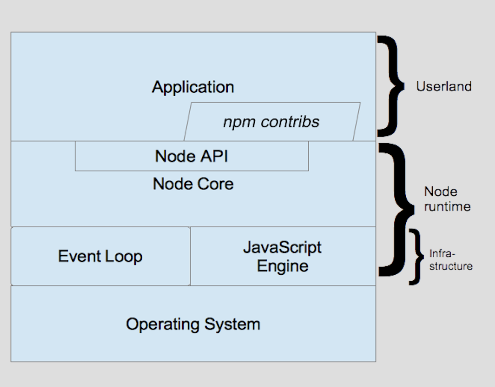

## Only for practice node

🎴🎴🃏🃏

### Node

Node 是什么

> Node 通常被描述为"服务器上的 JavaScript"，但这种描述有失公正

Node 团队提供的一种描述：

> [Node.js 是基于 Chrome V8 JavaScript 引擎构建的 JavaScript 运行时。](https://www.ibm.com/developerworks/cn/opensource/os-learn-nodejs-tour-node/index.html)

Node.js 架构堆栈



For each example, just run below script to see demo

```sh
# install dependency
npm i

# run
node --inspect xxx.js # open localhost:1122
```

### http

```
node-http.js
```

### websocket

```
node-os.js
```

### os

```
node-os.js
```

### file

```
node-file.js
```

#### 一些概念

I/O: 输入输出, 最简单的文件读写就是输入输出, 另外还有网络 I/O 等

同步异步: 同步异步关注的是 **消息通信机制** ([来源](https://www.zhihu.com/question/19732473))

> 所谓同步，就是在发出一个*调用*时，在没有得到结果之前，该*调用*就不返回。但是一旦调用返回，就得到返回值了。换句话说，就是由*调用者*主动等待这个*调用*的结果。而异步则是相反，*调用*在发出之后，这个调用就直接返回了，所以没有返回结果。换句话说，当一个异步过程调用发出后，调用者不会立刻得到结果。而是在*调用*发出后，*被调用者*通过状态、通知来通知调用者，或通过回调函数处理这个调用。

阻塞非阻塞: 关注的是程序在**等待调用结果（消息，返回值）时的状态.**, 典型例子 - 一个银行柜台, 一个一个顾客服务, 非阻塞典型例子 - 星巴克, 咖啡好了通知你取

> 阻塞调用是指调用结果返回之前，当前线程会被挂起。调用线程只有在得到结果之后才会返回。
> 非阻塞调用指在不能立刻得到结果之前，该调用不会阻塞当前线程。

REPL: Read-Eval-Print-Loop (REPL) 环境, 在命令行运行 node 就可以看到, 是非图形化交互式环境

工人线程池

中间件（middleware）: 位于 HTTP 服务器和应用程序的业务逻辑之间，可以访问 HTTP 请求和响应对象以进行处理
